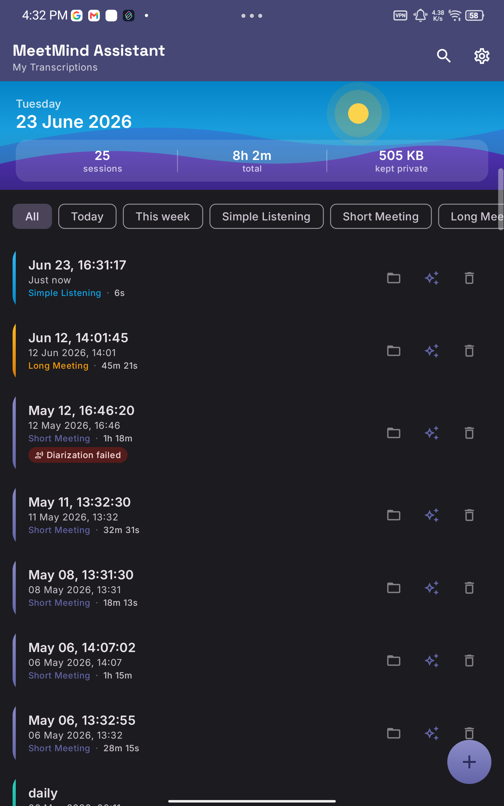
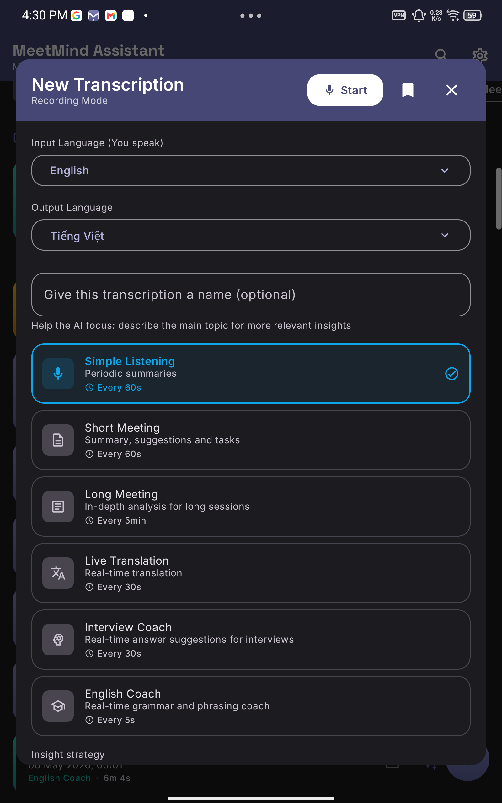
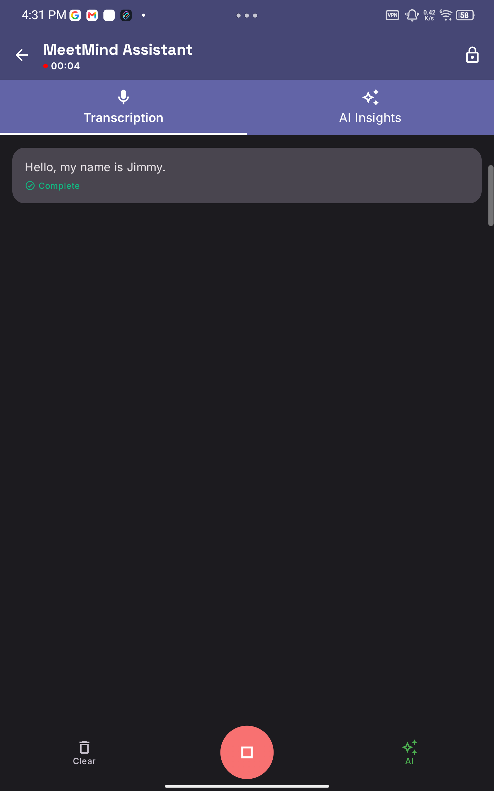
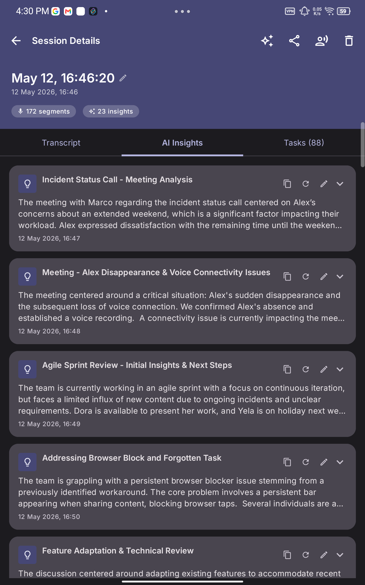
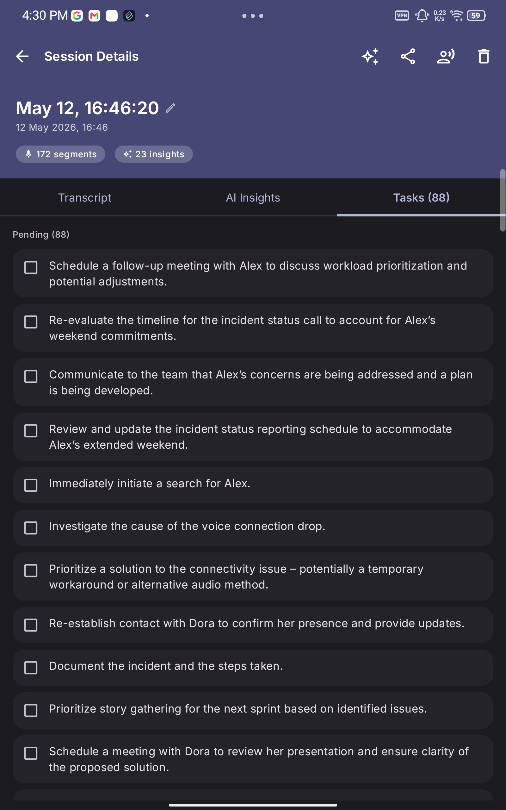

<p align="center">
  
</p>

<h1 align="center">MeetMind Assistant</h1>

<p align="center">
  <a href="LICENSE"></a>
  
  
  
</p>

<p align="center"><b>On-device audio transcription and AI insights for Android</b></p>

MeetMind Assistant combines a local Speech-to-Text engine with a local Large Language Model to deliver
real-time transcription and AI-generated insights — entirely offline, with no data sent to any
server.

---

## 🔒 Privacy-first, on-device AI — and completely free

MeetMind Assistant is built around a single principle: **your conversations never leave your phone.**

- **100% on-device AI** — both the Speech-to-Text engine (Sherpa-ONNX) and the Large Language Model
  (llama.cpp) run entirely on your device. There is **no cloud, no API key, and no account**. The app
  makes **zero network calls during recording**, so even sensitive meetings stay completely private.
- **No data collection** — transcripts, AI insights, and recordings are stored only in app-private
  storage on your device. Nothing is uploaded, sold, or shared.
- **Completely free, forever** — the entire app is free to use with **no subscriptions, no ads, and no
  paywalled features**. Every capability described below is available to everyone.
- **Open source under Apache 2.0** — the full source code is released under the
  [Apache License 2.0](LICENSE). You are free to use, study, modify, and redistribute it. The
  permissive license means anyone can verify exactly what the app does — privacy you can audit, not
  just trust.

---

## 📸 Screenshots

| Sessions overview | Recording modes | Live transcription |
|:---:|:---:|:---:|
|  |  |  |
| Your sessions, fully on-device — note the **"kept private"** storage stat | Six recording modes, incl. Live Translation & coaching | Real-time streaming transcription as you speak |

| AI Insights | Extracted tasks |
|:---:|:---:|
|  |  |
| On-device LLM generates meeting summaries & analysis | Action items automatically extracted from the conversation |

---

## Features

- **Real-time transcription** — streaming STT via Sherpa-ONNX (NeMo Parakeet TDT 0.6B Int8)
- **On-device AI insights** — contextual analysis via local LLM, fully on-device
- **100% offline** — privacy-first; no network calls during recording
- **Four recording modes** — Simple Listening, Short Meeting, Long Meeting, Real-Time Translation
- **25 UI languages** — full i18n including localized LLM system prompts
- **Global search** — full-text search across all transcriptions, AI insights and session names, with highlighted snippets and 300 ms debounce
- **Session management** — persistent sessions with rename, history, and segment detail view
- **Inline editing** — edit transcription segments, AI insight content, and individual tasks directly from session history
- **Post-stop UX** — stop button immediately shows a frozen Mic icon with a spinner while the final AI insight is being generated; back navigation is blocked until finalization completes
- **Recording timer** — live elapsed time with hours support (`h:mm:ss`)
- **Screen-off recording** — Foreground Service keeps recording when the display is off
- **Resumable downloads** — partial-file resume for both STT and LLM models
- **Dark mode** — full Material Design 3 support
- **Release-optimized** — R8 full-mode shrinking + ProGuard rules

---

## Recording Modes

| Mode | Description | AI Behaviour |
|---|---|---|
| **Simple Listening** | Lightweight transcription | Periodic summaries (~every 60s) |
| **Short Meeting** | Brief focused meetings | Summary + tasks + suggestions, high frequency (~every 60s) |
| **Long Meeting** | Extended conferences, many speakers | In-depth analysis, low frequency (~every 5min) |
| **Live Translation** | Translate speech as you speak | Real-time segment translation (~every 30s), no analysis wrapper |
| **Interview Coach** | Live answer suggestions for interviews | Real-time answer suggestions (~every 30s) |
| **English Coach** | Real-time grammar and phrasing coach | Real-time grammar & phrasing feedback (~every 5s) |

---

## Architecture

The project follows **Clean Architecture** with a strict dependency rule:

```
UI (app) → Presentation → Domain ← Data
```

No outer layer may import from an inner layer's implementation; only interfaces cross boundaries.

### Module Layout

```
MeetMind Assistant/
├── app/              # Composable UI, Navigation, Hilt entry points
├── domain/           # Pure Kotlin: models, repository interfaces, use cases
├── data/             # Repository impls, Room DB, DataStore, ModelDownloadManager
├── presentation/     # ViewModels, UiState, StateFlow
├── feature-stt/      # Sherpa-ONNX STT + AudioRecord pipeline
├── feature-llm/      # llama.cpp inference wrapper
├── lib-sherpa-onnx/  # JNI binding for Sherpa-ONNX
└── lib-llama-android/ # llama.cpp Android library (compiled from source via CMake)
```

### Key Design Decisions

- **`SupportedLanguages.ALL`** — single source of truth for the 25 language list used in UI,
  LLM prompt substitution, and future locale logic
- **`ModelConfig` / `DefaultModelConfig`** — all model URLs and filenames in one place; no
  scattered constants across download infrastructure
- **`AppIcons`** — centralized icon object; all icon references go through it
- **Prompt architecture** — system prompts live in `strings.xml` (`prompt_simple_listening`,
  `prompt_short_meeting`, `prompt_long_meeting`, `prompt_translation`); loaded at startup and
  stored in DataStore; translated in full for all 25 locales
- **KV cache reuse** — `setSystemPrompt` is called once per session; subsequent inference calls
  reuse the cached prefix instead of re-encoding the system prompt every time
- **Stateless LLM inference** — context is rebuilt per call from accumulated segments; this
  prevents unbounded context growth and allows clean mode switches

---

## AI Models

| Role | Model | Size |
|---|---|---|
| **STT** | NeMo Parakeet TDT 0.6B Int8 (Sherpa-ONNX) | ~670 MB (3 ONNX files + tokens.txt) |
| **LLM — Q8\_0** | Gemma 3 1B Q8\_0 (llama.cpp GGUF) | ~1 GB |
| **LLM — IQ4\_NL** | Gemma 3 1B IQ4\_NL (llama.cpp GGUF) | ~650 MB |

Both LLM variants use the same model; Q8\_0 offers higher output quality while IQ4\_NL is more
efficient on mid-range devices. The app automatically recommends the best variant based on device
RAM and Android version:

| Device condition | Recommended variant |
|---|---|
| RAM > 8 GB **and** Android 14+ (API 34+) | Q8\_0 |
| Otherwise | IQ4\_NL |

The recommended variant is downloaded automatically during onboarding. Both variants can be kept
on disk simultaneously and switched instantly from Settings without re-downloading.

Models are stored in app-specific storage (`getExternalFilesDir()`).
Downloads resume automatically from partial files on retry.

---

## STT Pipeline

```
AudioRecord (16 kHz mono, PCM 16-bit, AudioSource.MIC)
  → recording thread at THREAD_PRIORITY_URGENT_AUDIO
  → 100 ms read chunks → FloatArray SampleBuffer (GC-free, doubling growth)
  → VAD window loop (512-sample windows)
      ├─ speech detected → include 0.4 s lookback (6400 samples)
      └─ end of segment → final inference on full VAD buffer
  → partial inference gate:
      ├─ ≥ 200 ms elapsed since last call
      └─ ≥ 1.5 s (24000 samples) of new audio since last call
  → Parakeet TDT inference (capped at 30 s / 480000 samples per call)
  → .trim() → TranscriptionSegment (isComplete = false | true)
  → on segment end: carry over 3 s (48000 samples) of audio as context for next segment
```

### VAD / Audio Optimizations

| Parameter | Value | Rationale |
|---|---|---|
| `AudioSource.MIC` | — | Delivers raw PCM; `VOICE_RECOGNITION` activates HAL noise reduction on some devices that degrades transducer accuracy |
| Recording thread priority | `URGENT_AUDIO` | Prevents audio buffer drops under CPU load |
| ADPF hint (VAD/ASR thread) | 50 ms target | Signals scheduler to prefer big cores on big.LITTLE SoCs; prevents ASR parking on efficiency cores |
| VAD window size | 512 samples | Standard Silero-VAD frame size |
| Speech lookback | 6400 samples (0.4 s) | Captures word beginnings that precede the VAD trigger |
| Min new audio gate | 24000 samples (1.5 s) | Offline Parakeet needs sufficient audio context per call for consistent accuracy, regardless of device speed |
| Partial inference cap | 480000 samples (30 s) | Without this cap, inference time grows O(n²) for long segments (60 s segment → 9 s+ inference per call) |
| Context carry-over | 48000 samples (3 s) | Keeps acoustic context after a silence gap; model doesn't restart cold |
| Initial buffer capacity | 160000 samples (~10 s) | Pre-allocated to avoid early resizes during the first segment |
| Audio buffer multiplier | 4× `minBufferSize` | Absorbs scheduling jitter; reduces probability of `AudioRecord` overrun |
| VAD configurable params | threshold, min silence, max speech | Exposed in Settings, persisted in DataStore |
| `.trim()` on output | — | Parakeet tokenizer prepends a leading space to every transcription |
| GC-free `SampleBuffer` | `FloatArray` + doubling | Eliminates `Float` boxing overhead and GC pauses from `ArrayList<Float>` |

---

## LLM Pipeline

```
TranscriptionSegments (accumulated in rolling buffer, last 3 complete segments)
  → SyncSttLlmUseCase
      ├─ mode-specific system prompt (from strings.xml, stored in DataStore)
      ├─ analysis modes: "Context: <rolling> \n\n Analyze: <new content>"
      └─ translation mode: raw text only (no wrapper — prevents small-model echoing)
  → min-word gate (≥ 5 new words, skipped for translation)
  → concurrent-call guard (AtomicBoolean — skip if previous call still running)
  → thermal throttle (ThermalThrottle.Reduced doubles the interval when device is hot)
  → LlmRepository.generateInsight(prompt, systemPrompt, maxTokens)
  → LlamaAndroidDataSource → InferenceEngine (JNI) → ai_chat.cpp
  → token stream → JSON parse → LlmInsight (title, summary, action_items)
  → Room DB persistence
```

**Translation mode** sends raw text only — adding a "Context/Analyze" wrapper causes small
models to echo the wrapper keywords instead of translating.

### llama.cpp Optimizations (native layer — `ai_chat.cpp`)

`libai-chat.so` is compiled from C++ source on every build (CMake, `externalNativeBuild`).
| Optimization | Value / Setting | Rationale |
|---|---|---|
| Context size | 4096 tokens | Covers worst-case LONG_MEETING (~3968 tokens) while halving KV cache memory vs 8192 |
| Flash attention | `auto` (llama.cpp default) | llama.cpp enables FA automatically for Gemma3 on ARM; no explicit override needed |
| KV cache precision | `f16` (default) | Full-precision keys and values; Q8\_0 quantization was tested and reverted due to measurable quality degradation on structured JSON output |
| Batch / micro-batch size | `n_batch = n_ubatch = 512` | Matches original prebuilt behaviour; provides best throughput for typical prompt lengths |
| Thread count | `clamp(hint, 2, 4)`; hint=-1 (auto) or 2 (conservative) | `checkAndCacheMemoryConstraint()` sets hint=2 after detecting RAM pressure; persisted in DataStore. Complementary `isLargeContext()` proactively enables 2 threads for large inputs |
| Sampler temperature | 0.3 | Low temperature for deterministic, structured JSON output |
| KV cache reuse | system-prompt hash comparison | Unchanged system prompt reuses the encoded prefix; only user+assistant tokens are evicted between calls |
| Context shifting | discard older half after `system_prompt_position` | Prevents hard context overflow for very long sessions |
| Single-threaded dispatcher | `Dispatchers.Default.limitedParallelism(1)` | llama.cpp is not thread-safe; all JNI calls are serialized on one coroutine thread |
| Error-state recovery | `cleanUp()` before reload | Resets internal state after an `Error` (e.g. OOM) so the next `loadModel` succeeds |
| **Adaptive unload between inferences** | `availMem < threshold × 3` (Long Meeting only) | Model freed after each inference when RAM is constrained; reloaded before the next one. Prevents kswapd from reclaiming mmap-ed pages during the 5–15 min idle gap (1000+ faults → ANR). Batch processing never frees between chunks |

### Token Budgets per Mode

| Mode | `maxTokens` |
|---|---|
| Simple Listening | 512 |
| Short Meeting | 600 |
| Long Meeting | 768 |
| Real-Time Translation | 256 |

Token budget flows from `SyncSttLlmUseCase` → `LlmRepository` → `LlamaAndroidDataSource`
→ native `processUserPrompt(n_predict)` → stops `generateNextToken()` at `stop_generation_position`.

### Inference Scheduling

| Guard | Mechanism | Purpose |
|---|---|---|
| Min new words | 5 words (configurable) | Skips near-empty intervals; avoids wasting a 2–8 s inference on a single word |
| Concurrent-call guard | `AtomicBoolean isLlmBusy` | If previous inference is still running when the timer fires, the interval is skipped entirely |
| Thermal throttle | `ThermalThrottle` flow | Multiplies the inference interval by 1.5× when the device reaches `THERMAL_STATUS_SEVERE`, protecting battery |
| Memory pressure | `availMem < memInfo.threshold × 3` | Adaptive threshold anchored to Android's own low-memory level for the device (~150–250 MB); multiplier of 3 gives ~450–750 MB floor — frees the LLM proactively before kswapd starts reclaiming its pages |

### Indicative Targets

- STT latency: < 200 ms per segment (high-end ARM device)
- LLM inference: 2–8 s per insight (varies by chip and mode)
- Memory footprint: < 800 MB active (STT + LLM loaded)

---

## Tech Stack

| Layer | Libraries |
|---|---|
| UI | Jetpack Compose, Material Design 3 |
| DI | Hilt |
| Async | Kotlin Coroutines + Flow |
| Persistence | Room (sessions, segments, insights), DataStore (settings) |
| STT | Sherpa-ONNX (JNI), ONNX Runtime |
| LLM | llama.cpp (JNI) |
| Serialization | Kotlinx Serialization (JSON) |
| Fonts | Space Grotesk (title), Inter (UI), JetBrains Mono (transcript) |

---

## Build & Run

### Prerequisites

| Tool | Version |
|------|---------|
| Android Studio | Iguana (2023.2.1) or later |
| JDK | 17 |
| Android SDK | compile / target **35**, min **35** |
| Android NDK | **r27** (`27.2.12479018`) |
| CMake | 3.31+ (installed via SDK Manager) |
| Git LFS | any recent version |

> **Physical device strongly recommended** — emulator audio capture is unreliable.
> ~1.7 GB of free device storage is required for both AI models.

### Steps

```bash
# 1. Install Git LFS (once per machine)
git lfs install

# 2. Clone (LFS objects are downloaded automatically)
git clone https://github.com/jimmycuong1412/meetmind-assistant.git
cd meetmind-assistant

# 3. Configure Firebase
#    Copy the example file and fill in your own Firebase project credentials.
#    See: https://console.firebase.google.com → Project Settings → google-services.json
cp app/google-services.json.example app/google-services.json
# Then edit app/google-services.json with your actual values.

# 4. Build debug APK
./gradlew.bat assembleDebug        # Windows
./gradlew assembleDebug            # Linux / macOS

# 5. Install on device
adb install app/build/outputs/apk/debug/app-debug.apk
```

> **Note — Firebase is optional for local development.** Analytics and Crashlytics are only
> active in release builds. The debug build will compile and run without a real Firebase project
> as long as `app/google-services.json` exists (the example file is sufficient).

### First Run

1. Complete the onboarding flow
2. Download the STT model (~670 MB) — required to record
3. Optionally download the LLM model — the app recommends Q8\_0 (~1 GB) or IQ4\_NL (~650 MB)
   based on your device; both variants can be downloaded from Settings at any time
4. Grant `RECORD_AUDIO` permission when prompted
5. Tap **+** to create a session, select a recording mode, and press the FAB to start

---

## Localization

Supported locales (25): `en`, `bg`, `cs`, `da`, `de`, `el`, `es`, `et`, `fi`, `fr`, `hr`, `hu`,
`it`, `lt`, `lv`, `mt`, `nl`, `pl`, `pt`, `ro`, `ru`, `sk`, `sl`, `sv`, `uk`

Every locale file contains fully translated UI strings **and** LLM system prompts. JSON field
names (`"title"`, `"summary"`, `"action_items"`) remain in English across all locales to ensure
consistent JSON parsing.

---

## Roadmap

- [x] Global transcription search (full-text, highlighted snippets)
- [x] Inline editing of transcription segments, AI insights, and tasks
- [x] Post-stop processing UX (frozen Mic + spinner, back-navigation lock)
- [ ] Export sessions (TXT / JSON / PDF)
- [ ] Speaker diarization
- [ ] Home screen widget for quick record
- [ ] Kotlin Multiplatform (iOS support)

---

## 🙏 Acknowledgements

MeetMind Assistant is built on top of the excellent open-source project
**[HearoPilot](https://github.com/Helldez/HearoPilot-App)** by **[Helldez](https://github.com/Helldez)**,
which is also released under the Apache License 2.0.

A huge thank-you to the author for creating and open-sourcing HearoPilot. This project would not exist
without that foundation — the on-device STT + LLM architecture, the privacy-first design, and the
multilingual prompt system all trace back to their work. 🙌

If you find MeetMind Assistant useful, please consider starring the original
[HearoPilot repository](https://github.com/Helldez/HearoPilot-App) as well.

---

## Credits

- **Original project** — [HearoPilot](https://github.com/Helldez/HearoPilot-App) by [Helldez](https://github.com/Helldez)
- **STT engine** — [Sherpa-ONNX](https://github.com/k2-fsa/sherpa-onnx) by k2-fsa
- **LLM engine** — [llama.cpp](https://github.com/ggerganov/llama.cpp) by ggerganov
- **STT model** — NeMo Parakeet TDT 0.6B by NVIDIA
- **LLM model** — Gemma 3 1B by Google DeepMind

---

## License

Copyright 2026 de.ai (Decentralized AI)

Licensed under the [Apache License, Version 2.0](LICENSE).
You may not use this project except in compliance with the License.
